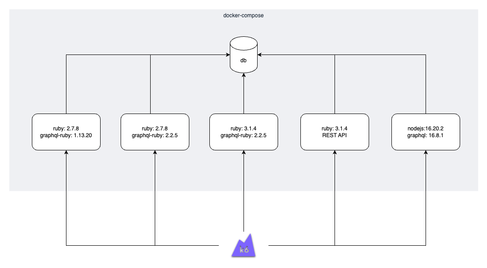
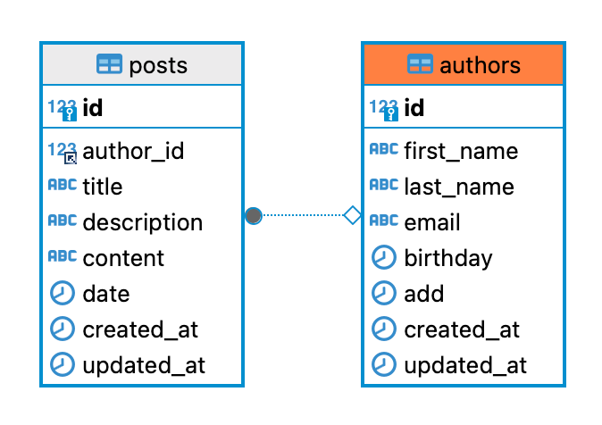

graphql-rubyの速度検証
---

graphql ruby(gem)とrubyバージョン組み合わせによる、速度検証用リポジトリ

## 構成



## database作成

```bash
docker-compose exec app1 rails db:create
```

### テーブル構成



### DBデータ投入コマンド

```bash
mysql -u root -h localhost --protocol=tcp -ppassword graphql < db_data/authors.sql
mysql -u root -h localhost --protocol=tcp -ppassword graphql < db_data/posts.sql
```


## 速度検証ツール

k6を使用

### インストール

```bash
brew install k6
```

### コマンド

```bash
k6 run k6/script.js --out csv=k6/output/result.csv
```
